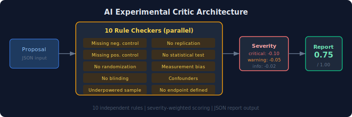

# ai-experimental-critic

Rule-based critique engine for experiment proposals — identifies missing controls, bias risks, and statistical issues.

## Why This Exists

Experiment design is where scientific rigor lives or dies. A missing control group invalidates months of work. An underpowered sample wastes grant money. These are checkable problems — you don't need an LLM to catch a missing placebo group.

This tool applies 10 independent critique rules to experiment proposals, mimicking the systematic review a senior PI would provide. Each finding is severity-rated (critical/warning/info) and contributes to a weighted quality score.

## Architecture

<p align="center">
  
</p>

## The 10 Rules

| # | Rule | Severity | What it checks |
|---|------|----------|---------------|
| 1 | Missing negative control | Critical | Vehicle/untreated/placebo control present? |
| 2 | Missing positive control | Warning | Known-effect control included? |
| 3 | No randomization | Critical | Subject allocation randomized? |
| 4 | No blinding | Critical | Blinding strategy specified? |
| 5 | Underpowered sample | Critical | Sample size >= 10? |
| 6 | No replication | Warning | Replication >= 3? |
| 7 | No statistical test | Critical | Statistical test pre-specified? |
| 8 | Measurement bias risk | Warning | Blinded/automated measurement? |
| 9 | Confounding variables | Warning | >= 2 variables controlled? |
| 10 | No endpoint defined | Warning | Primary endpoint in methods? |

## Install

```bash
pip install -e ".[dev]"
```

## Quickstart

```bash
python -m experimental_critic.cli critique --input demo_data/proposal_1.json
```

## Example Output

```
========================================================================
EXPERIMENT CRITIQUE REPORT
========================================================================
Proposal: Drug X reduces tumor growth in mice
Overall score: 0.25  (10 finding(s))
------------------------------------------------------------------------
  [CRITICAL] #1 missing_negative_control
    No negative / vehicle / untreated control identified.
    -> Add a negative control group (e.g. vehicle-only, untreated,
       or placebo) to establish a baseline.

  [CRITICAL] #3 no_randomization
    Randomization is absent or not specified.
    -> Randomize subject allocation to treatment groups to reduce
       selection bias.

  [CRITICAL] #5 underpowered_sample
    Sample size (5) is below the recommended minimum of 10.
    -> Perform a power analysis and increase sample size to ensure
       adequate statistical power (typically >=80%).
  ...
========================================================================
```

The demo includes 3 proposals of varying quality (bad/good/mediocre) to demonstrate the scoring range.

## Tests

```bash
python -m pytest  # 16 tests
```

## Part of [bio-ai-systems](https://github.com/apeddcrusader/bio-ai-systems)

A collection of tools exploring how AI can assist biological reasoning. See the [full ecosystem](https://github.com/apeddcrusader/bio-ai-systems) for related projects.

## License

MIT
